# 🌐 AWS Static Website Deployment — High Availability & Multi-Tier Security


A production-grade, highly available, and secure static website deployed on AWS. The architecture uses a **3-tier subnet design** (Public / Private-App / Private-Data) across **2 Availability Zones**, with EC2 web servers isolated in private subnets, traffic distributed through an Application Load Balancer, and Auto Scaling for self-healing infrastructure.


> 📹 > 📹 **Video Walkthrough:** [Watch on YouTube](https://youtu.be/7_YOSnNIehE)

---

## 📐 Reference Architecture

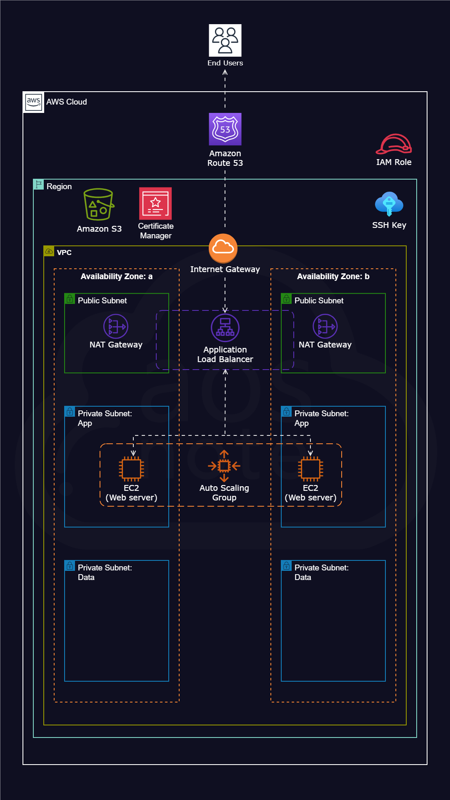

---

## 🛠️ AWS Services Used

| Service | Role |
|---|---|
| **VPC** (`dev-vpc`) | Custom isolated network — `vpc-034ce28cb3e9b7ab6` |
| **Internet Gateway** (`dev-igw`) | Entry point for all public internet traffic into the VPC |
| **Public Subnets** (×2) | Host the ALB and NAT Gateways — one per AZ |
| **Private App Subnets** (×2) | Host EC2 web servers — isolated from the internet |
| **Private Data Subnets** (×2) | Reserved for future database layer — currently empty |
| **NAT Gateway** (`dev-natgw-az1`) | Allows private EC2s to reach internet (for S3, updates) without being reachable from it |
| **Security Groups** | `dev-sg-alb`, `dev-sg-web`, `dev-sg-ssh` — layered firewall rules |
| **S3** (`dev-app-webfiles-...-eu-central-1`) | Stores static website files — EC2s pull from here on launch |
| **IAM Role** | EC2 instance role for least-privilege S3 access — no hardcoded credentials |
| **EC2** (t2.micro, ×2 running) | Apache web servers in private app subnets |
| **Launch Template** (`dev-lt`) | Defines EC2 config reused by the Auto Scaling Group |
| **Auto Scaling Group** (`dev-asg`) | Desired: 1, Scaling limits: 1–2 — self-healing and scalable |
| **Application Load Balancer** (`dev-alb`) | Internet-facing ALB distributing HTTPS traffic across both AZs |
| **Route 53** (`aosnoteproject.com`) | Public hosted zone — A record aliased to `dev-alb` |
| **Certificate Manager** | SSL cert for `aosnoteproject.com` + `*.aosnoteproject.com` — Status: Issued |

---

## ✨ Key Features

- **3-Tier Subnet Architecture** — Public (ALB/NAT), Private-App (EC2), Private-Data (future DB) across 2 AZs
- **EC2 in Private Subnets** — Web servers have no public IP; only the ALB can forward traffic to them
- **NAT Gateway** — Private instances reach S3 and the internet outbound, but are unreachable inbound
- **Auto Scaling** — Self-healing: failed instances are detected and replaced automatically
- **Wildcard SSL Certificate** — Covers both `aosnoteproject.com` and `*.aosnoteproject.com`
- **Least-Privilege IAM** — EC2 accesses S3 via an instance role; no access keys on the server

---

## 🔐 Security Design

```
Layer 1: Route 53              → Routes domain to ALB only
Layer 2: ACM (SSL/TLS)         → Wildcard cert; HTTPS enforced at ALB
Layer 3: dev-sg-alb            → ALB accepts ports 80 and 443 from internet
Layer 4: dev-sg-web            → EC2 accepts traffic from ALB SG only (not internet)
Layer 5: Private App Subnet    → No public IP on web servers at all
Layer 6: dev-sg-ssh            → SSH locked to admin access via Bastion only
Layer 7: IAM Instance Role     → S3 access via role — zero hardcoded credentials
```

---

## 🖼️ Screenshots

| # | Service | Screenshot |
|---|---|---|
| 1 | Console Home | 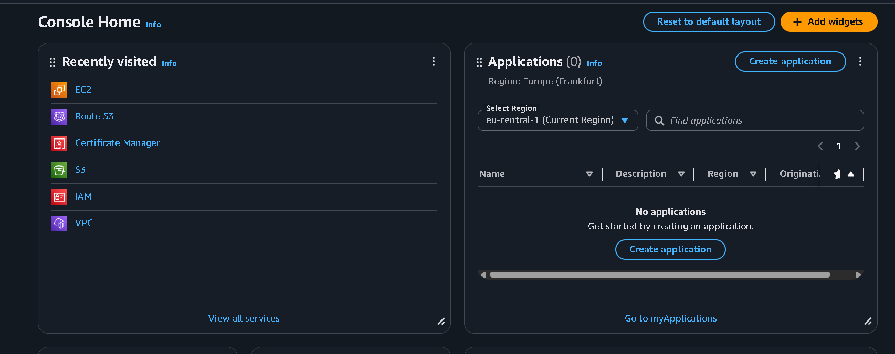 |
| 2 | VPC Dashboard |  |
| 3 | Subnets (6 total — Public ×2, Private-App ×2, Private-Data ×2) | 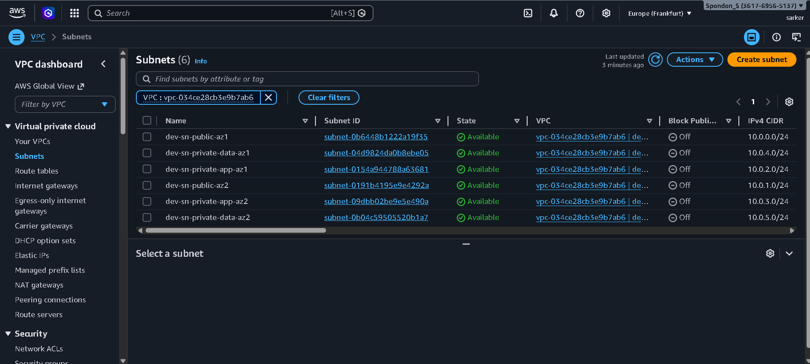 |
| 4 | NAT Gateway (`dev-natgw-az1`) | 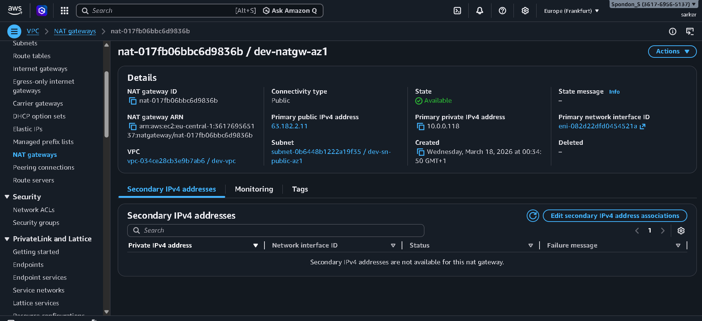 |
| 5 | S3 Bucket | 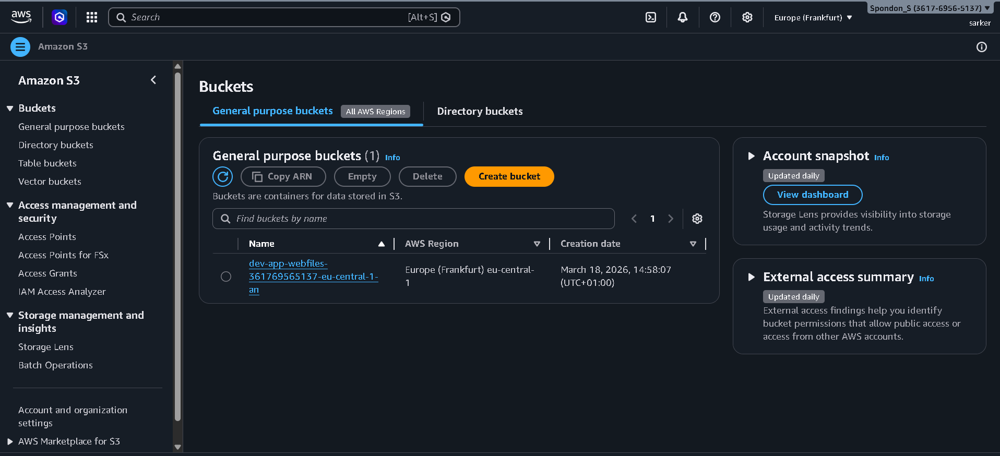 |
| 6 | Security Groups (7 total) | 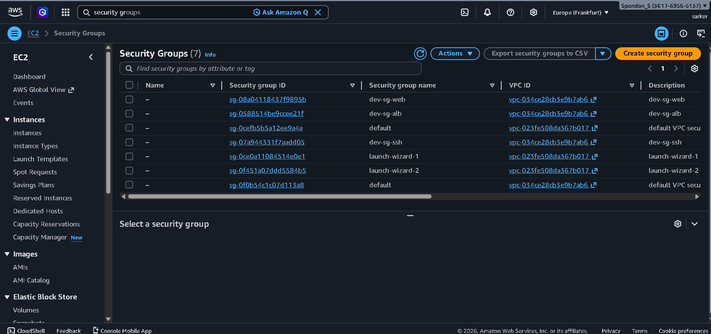 |
| 7 | IAM User | 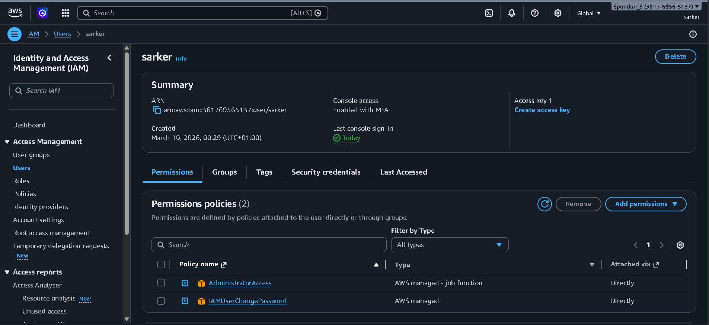 |
| 8 | Application Load Balancer (`dev-alb`) | 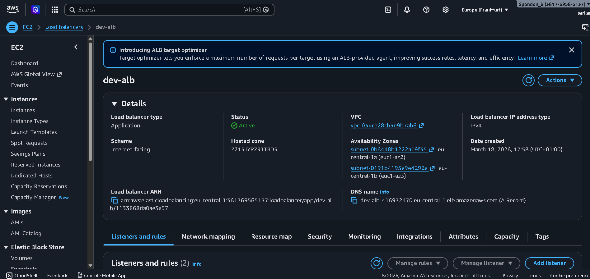 |
| 9 | Route 53 Hosted Zone (`aosnoteproject.com`) | 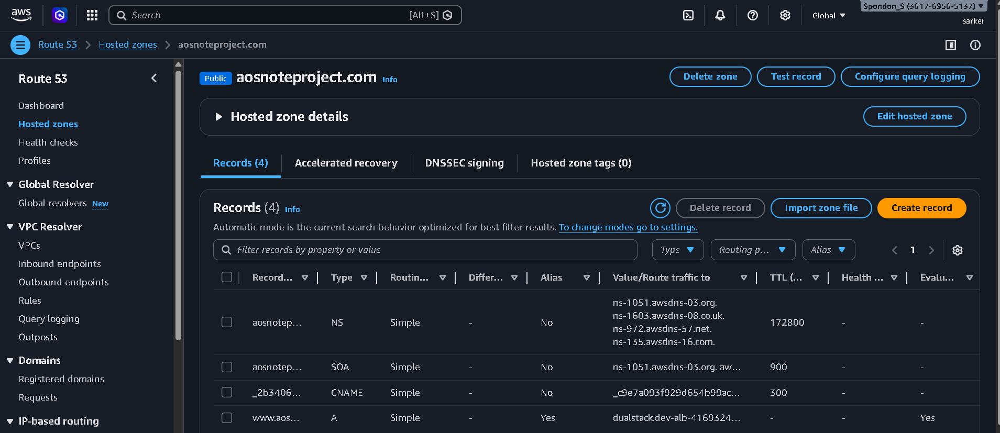 |
| 10 | Internet Gateway (`dev-igw`) | 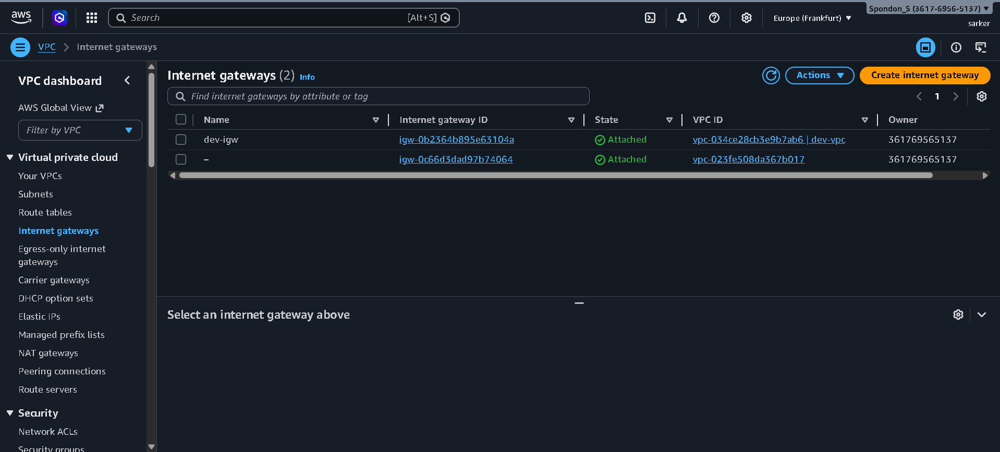 |
| 11 | EC2 Dashboard (2 running instances) | 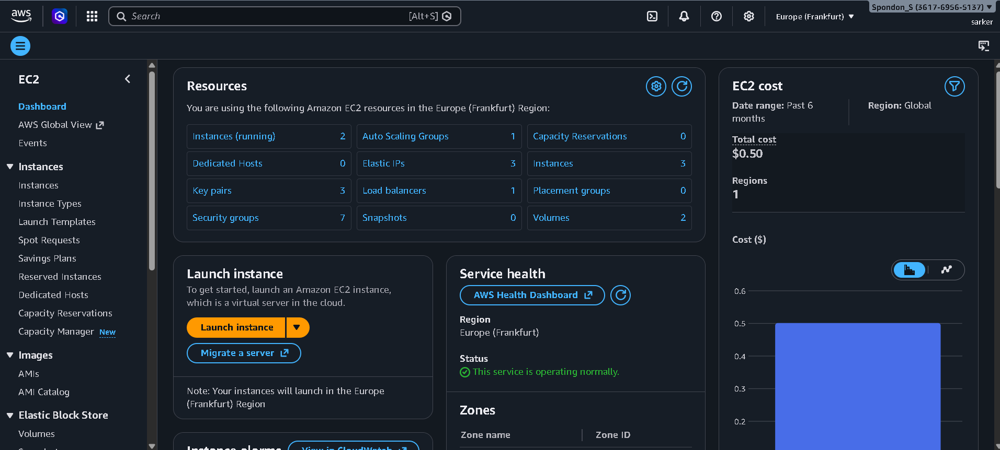 |
| 12 | Auto Scaling Group (`dev-asg`) | 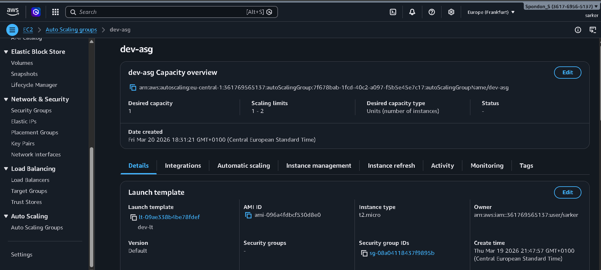 |
| 13 | ACM Certificate (Issued) | 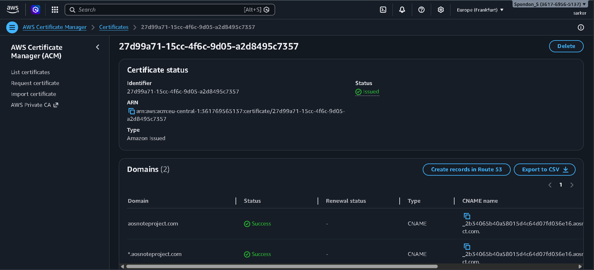 |
| 14 | Reference Architecture |  |

---

## 📁 Repository Structure

```
aws-static-website-deployment/
│
├── README.md
├── screenshots/
│   ├── 01-console-home.png
│   ├── 02-vpc-dashboard.png
│   ├── 03-subnets.png
│   ├── 04-nat-gateway.png
│   ├── 05-s3-bucket.png
│   ├── 06-security-groups.png
│   ├── 07-iam.png
│   ├── 08-load-balancer.png
│   ├── 09-route53.png
│   ├── 10-internet-gateway.png
│   ├── 11-ec2-dashboard.png
│   ├── 12-autoscaling-group.png
│   ├── 13-acm-certificate.png
│   └── 14-reference-architecture.png
└── scripts/
    └── ec2-user-data.sh
```

---

## ⚙️ Real Configuration (from AWS Console)

### Subnets — 6 total across 2 AZs
| Name | Type | CIDR | AZ |
|---|---|---|---|
| dev-sn-public-az1 | Public | 10.0.0.0/24 | eu-central-1a |
| dev-sn-public-az2 | Public | 10.0.1.0/24 | eu-central-1b |
| dev-sn-private-app-az1 | Private (App) | 10.0.2.0/24 | eu-central-1a |
| dev-sn-private-app-az2 | Private (App) | 10.0.3.0/24 | eu-central-1b |
| dev-sn-private-data-az1 | Private (Data) | 10.0.4.0/24 | eu-central-1a |
| dev-sn-private-data-az2 | Private (Data) | 10.0.5.0/24 | eu-central-1b |

### Security Groups
| Name | Purpose | Inbound |
|---|---|---|
| `dev-sg-alb` | Application Load Balancer | 80, 443 from internet |
| `dev-sg-web` | EC2 Web Servers | 80 from `dev-sg-alb` only |
| `dev-sg-ssh` | SSH / Bastion access | 22 from admin IP only |

### Auto Scaling Group (`dev-asg`)
| Setting | Value |
|---|---|
| Launch Template | `dev-lt` |
| Instance Type | t2.micro |
| Desired Capacity | 1 |
| Scaling Limits | 1 – 2 |
| Health Check | ELB |

### Load Balancer (`dev-alb`)
| Setting | Value |
|---|---|
| Type | Application |
| Scheme | Internet-facing |
| AZs | eu-central-1a, eu-central-1b |
| Listeners | HTTP (80) → redirect to HTTPS, HTTPS (443) → forward |

### ACM Certificate
| Domain | Status |
|---|---|
| `aosnoteproject.com` | ✅ Success |
| `*.aosnoteproject.com` | ✅ Success |

---

## 🚀 EC2 Bootstrap Script

```bash
#!/bin/bash
# ec2-user-data.sh — Runs on every EC2 launch via the Launch Template

yum update -y
yum install -y httpd
systemctl start httpd
systemctl enable httpd

# Pull website files from S3 using the attached IAM role — no credentials needed
aws s3 sync s3://dev-app-webfiles-361769565137-eu-central-1-an/ /var/www/html/

echo "Deployed on $(hostname) at $(date)" >> /var/log/deploy.log
```

---

## 💡 What I Learned

- Designing a 3-tier VPC (Public / Private-App / Private-Data) across 2 Availability Zones
- Using a NAT Gateway to give private EC2 instances outbound internet access without a public IP
- Configuring an ALB to terminate SSL and route traffic into private subnets
- Separating security groups by role — `dev-sg-alb`, `dev-sg-web`, `dev-sg-ssh`
- Using a Launch Template with Auto Scaling for self-healing, reproducible infrastructure
- Attaching IAM instance roles so no AWS credentials are ever stored on a server
- Issuing a wildcard SSL certificate in ACM and validating via Route 53 CNAME records

---

## 👤 Author

**Spondon**  
MSc Computational Mathematics · AWS Certified Solutions Architect · CKA  
🎯 Targeting: MLOps Engineering  
🔗 [GitHub](https://github.com/Spondon094)
