# 🌐 AWS Dynamic Website Deployment — High Availability & Multi-Tier Security


A production-grade, highly available, and secure dynamic website (**Nest Mart & Grocery**) deployed on AWS. This project extends the static website architecture by adding a **MySQL RDS database**, **Secrets Manager** for credential management, an **AMI** for reproducible deployments, and **EC2 Instance Connect Endpoint (EICE)** as a modern, keyless replacement for the Bastion Host pattern.

> 📹 **Video Walkthrough:** [Watch on Google Drive](https://drive.google.com/file/d/1-2f_7ilJ6U3tkLb5WAI2MTrgzx_ZtMWh/view?usp=sharing)

---

## 📐 Reference Architecture

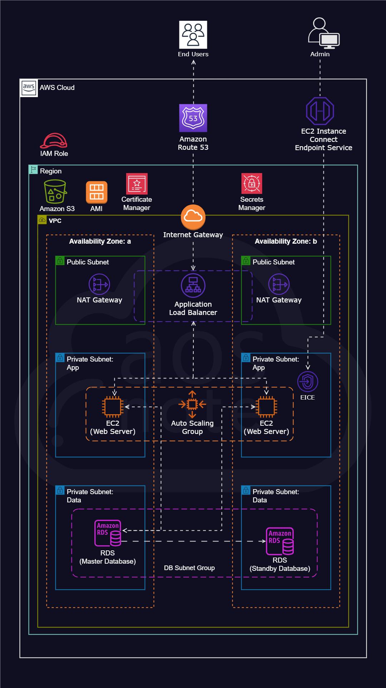

---

## 🛠️ AWS Services Used

| Service | Role |
|---|---|
| **VPC** (`dev-vpc`) | Custom isolated network — `vpc-034ce28cb3e9b7ab6` |
| **Internet Gateway** (`dev-igw`) | Entry point for all public internet traffic into the VPC |
| **Public Subnets** (×2) | Host the ALB and NAT Gateways — one per AZ |
| **Private App Subnets** (×2) | Host EC2 web servers — isolated from the internet |
| **Private Data Subnets** (×2) | Host RDS database instances — no internet access |
| **NAT Gateway** (`dev-natgw-az1`) | Allows private EC2s to reach internet outbound without a public IP |
| **Security Groups** (9 total) | `dev-sg-alb`, `dev-sg-web`, `dev-sg-eice`, `dev-sg-db`, `dev-sg-dms` |
| **S3** (`dev-app-webfiles-...-eu-central-1`) | Stores application code — `nest.zip`, `V1__nest.sql`, `AppServiceProvider.php` |
| **IAM Roles** | `dev-role-s3-access`, `dev-role-s3-secrets-manager` — no hardcoded credentials |
| **Secrets Manager** (`dev-app-secrets`) | Securely stores RDS database credentials — EC2 retrieves at runtime |
| **RDS** (`dev-db`) | MySQL Community, db.t3.micro — available in eu-central-1a |
| **DB Subnet Group** (`dev-subnet-group`) | Groups private data subnets across 2 AZs for RDS |
| **AMI** (`dev-nest-app-ami`) | Snapshot of fully configured EC2 — used by Launch Template for consistent deployments |
| **EC2** (t2.micro, ×2 running) | Apache web servers in private app subnets |
| **EICE** (`dev-sg-eice`) | EC2 Instance Connect Endpoint — keyless SSH access to private EC2s without a Bastion Host |
| **Launch Template** (`dev-lt`) | Defines EC2 config using the custom AMI — reused by Auto Scaling Group |
| **Auto Scaling Group** (`dev-asg`) | Desired: 1, Scaling limits: 1–2 — self-healing and scalable |
| **Application Load Balancer** (`dev-alb`) | Internet-facing, distributes HTTPS traffic across both AZs |
| **Route 53** (`aosnoteproject.com`) | Public hosted zone — A record aliased to `dev-alb` |
| **Certificate Manager** | Wildcard SSL cert for `aosnoteproject.com` + `*.aosnoteproject.com` — Status: Issued |

---

## ✨ Key Features

- **Dynamic Website with RDS** — Nest Mart & Grocery app backed by MySQL database in private data subnets
- **Secrets Manager Integration** — RDS credentials stored securely; EC2 retrieves them at runtime via IAM role
- **AMI-based Deployments** — Custom AMI (`dev-nest-app-ami`) ensures every new EC2 instance is pre-configured identically
- **EICE (No Bastion Host)** — EC2 Instance Connect Endpoint replaces Bastion Host for secure, keyless SSH access to private instances
- **3-Tier Subnet Architecture** — Public (ALB/NAT), Private-App (EC2), Private-Data (RDS) across 2 AZs
- **Auto Scaling** — Self-healing: failed instances replaced automatically using the custom AMI
- **Wildcard SSL Certificate** — Covers both `aosnoteproject.com` and `*.aosnoteproject.com`

---

## 🔐 Security Design

```
Layer 1: Route 53              → Routes domain to ALB only
Layer 2: ACM (SSL/TLS)         → Wildcard cert; HTTPS enforced at ALB
Layer 3: dev-sg-alb            → ALB accepts 80 and 443 from internet only
Layer 4: dev-sg-web            → EC2 accepts traffic from ALB SG only
Layer 5: Private App Subnet    → No public IP on web servers
Layer 6: dev-sg-eice           → Keyless SSH access via EICE — no Bastion needed
Layer 7: dev-sg-db             → RDS accepts traffic from EC2 SG only
Layer 8: Private Data Subnet   → RDS has no internet access at all
Layer 9: Secrets Manager       → DB credentials never hardcoded — retrieved via IAM role
```

---

## 🖼️ Screenshots

| # | Service | Screenshot |
|---|---|---|
| 1 | VPC Dashboard | 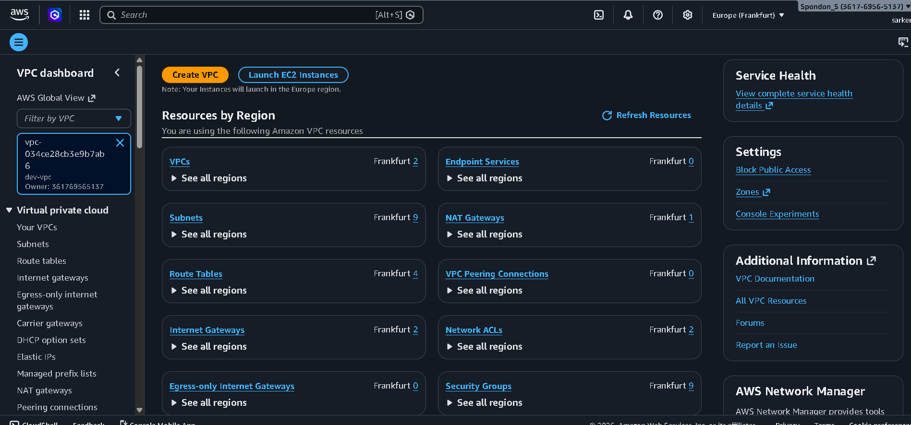 |
| 2 | Subnets (6 total) | 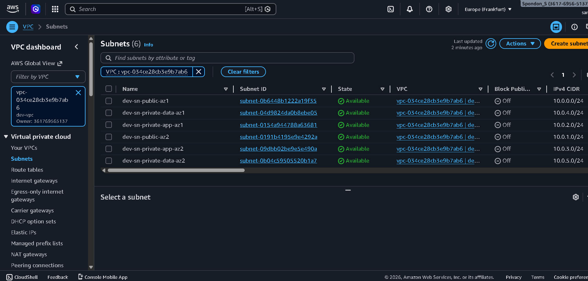 |
| 3 | NAT Gateway (`dev-natgw-az1`) | 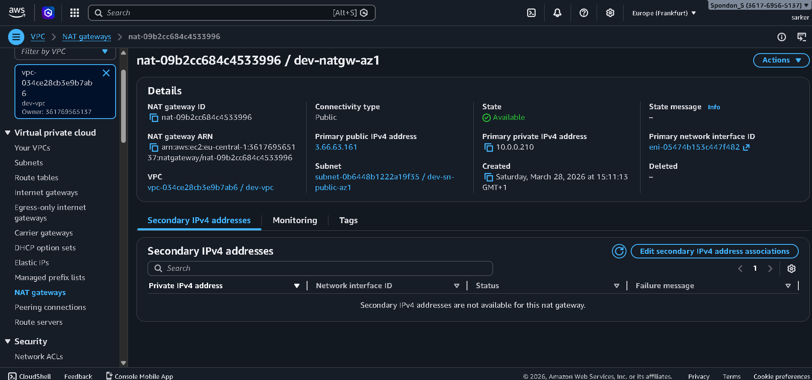 |
| 4 | S3 Bucket (`nest/` folder) | 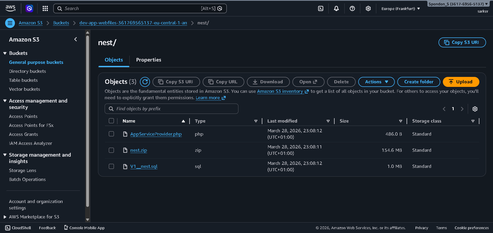 |
| 5 | Security Groups (9 total) | 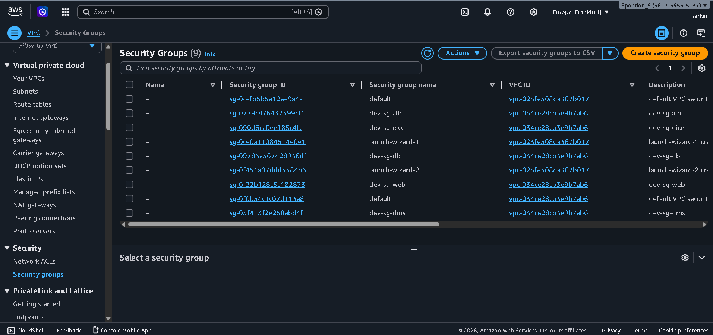 |
| 6 | IAM Roles | 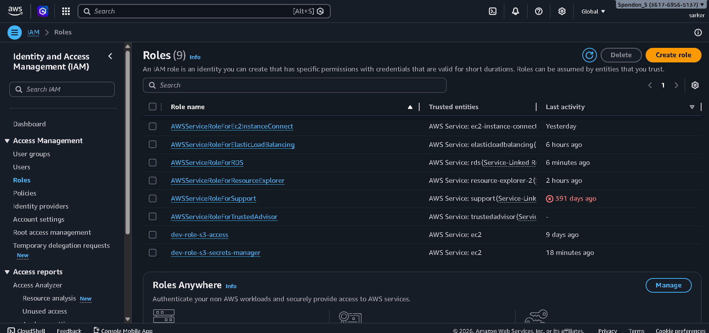 |
| 7 | RDS Subnet Group (`dev-subnet-group`) |  |
| 8 | RDS Database (`dev-db`) | 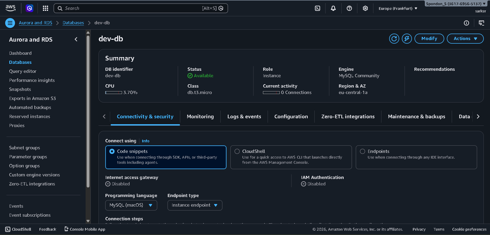 |
| 9 | RDS Subnet Details | 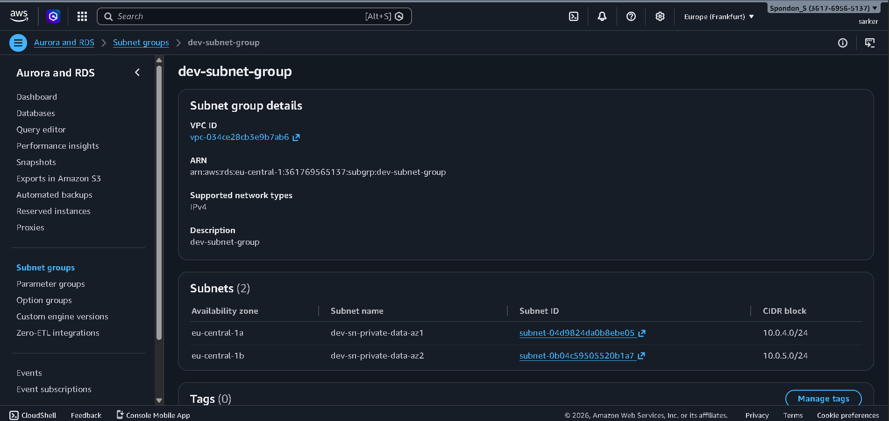 |
| 10 | Secrets Manager (`dev-app-secrets`) | 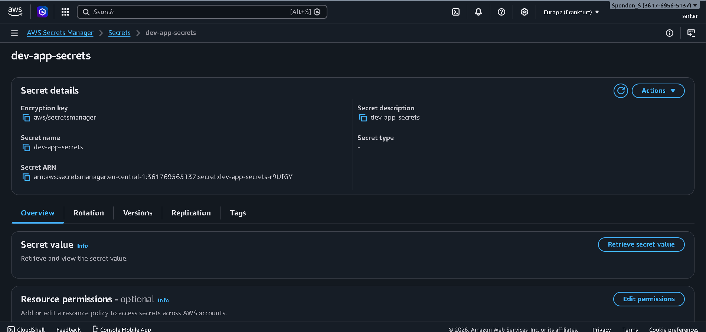 |
| 11 | AMI (`dev-nest-app-ami`) | 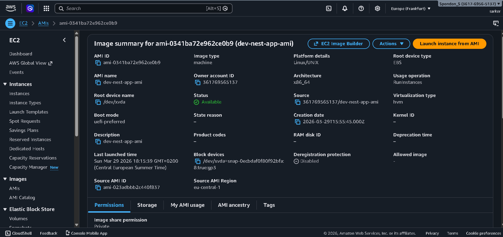 |
| 12 | EC2 Dashboard (2 running) | 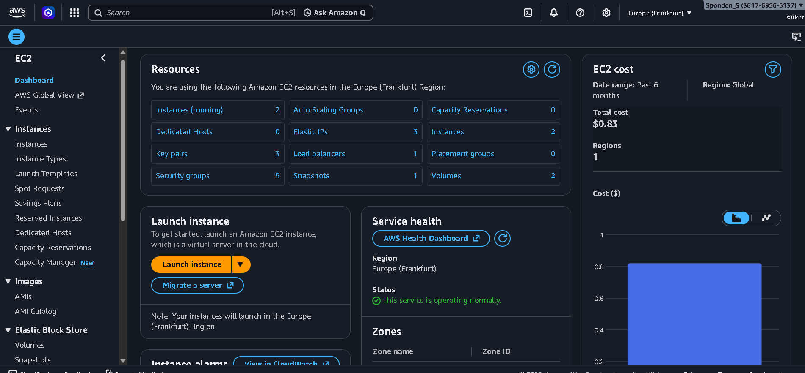 |
| 13 | RDS Databases List | 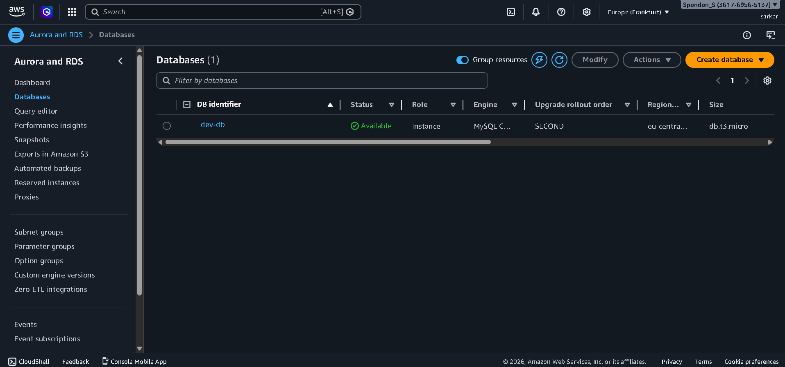 |
| 14 | Load Balancer (`dev-alb`) | 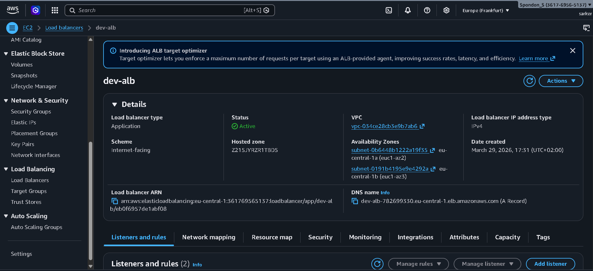 |
| 15 | Auto Scaling Group (`dev-asg`) | 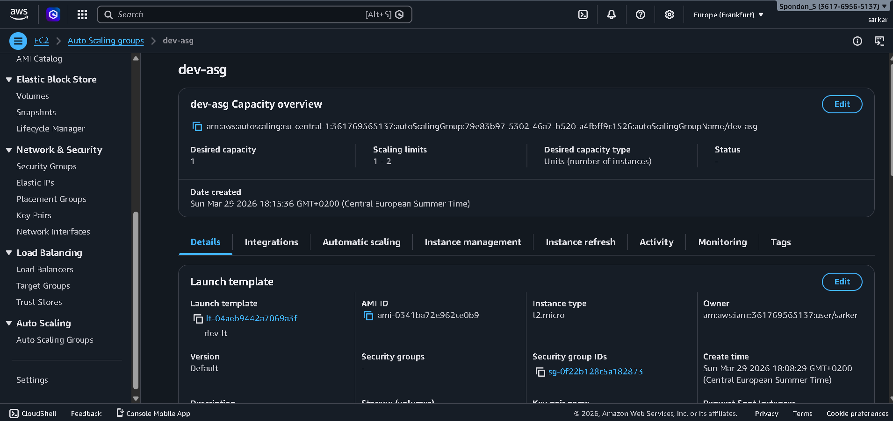 |
| 16 | Route 53 (`aosnoteproject.com`) | 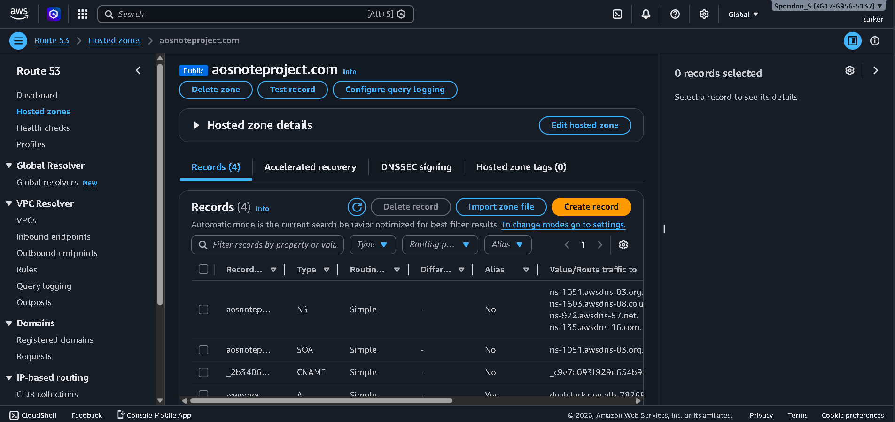 |
| 17 | ACM Certificate (Issued) | 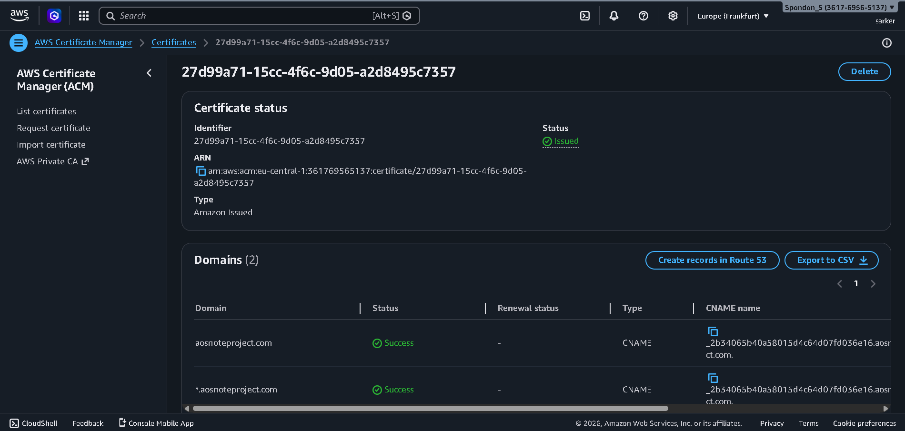 |
| 18 | Live Website |  |
| 19 | Reference Architecture |  |

---

## 📁 Repository Structure

```
02-dynamic-website/
│
├── README.md
├── screenshots/
│   ├── 01-vpc-dashboard.png
│   ├── 02-subnets.png
│   ├── 03-nat-gateway.png
│   ├── 04-s3-bucket.png
│   ├── 05-security-groups.png
│   ├── 06-iam-roles.png
│   ├── 07-rds-subnet-group.png
│   ├── 08-rds-database.png
│   ├── 09-rds-subnet-details.png
│   ├── 10-secrets-manager.png
│   ├── 11-ami.png
│   ├── 12-ec2-dashboard.png
│   ├── 13-rds-databases.png
│   ├── 14-load-balancer.png
│   ├── 15-autoscaling-group.png
│   ├── 16-route53.png
│   ├── 17-acm-certificate.png
│   ├── 18-live-website.png
│   └── 19-reference-architecture.png
└── scripts/
    └── deployment_script.sh
```

---

## ⚙️ Real Configuration (from AWS Console)

### Subnets — 6 total across 2 AZs
| Name | Type | CIDR | AZ |
|---|---|---|---|
| dev-sn-public-az1 | Public | 10.0.0.0/24 | eu-central-1a |
| dev-sn-public-az2 | Public | 10.0.1.0/24 | eu-central-1b |
| dev-sn-private-app-az1 | Private (App) | 10.0.2.0/24 | eu-central-1a |
| dev-sn-private-app-az2 | Private (App) | 10.0.3.0/24 | eu-central-1b |
| dev-sn-private-data-az1 | Private (Data) | 10.0.4.0/24 | eu-central-1a |
| dev-sn-private-data-az2 | Private (Data) | 10.0.5.0/24 | eu-central-1b |

### Security Groups (9 total)
| Name | Purpose | Inbound |
|---|---|---|
| `dev-sg-alb` | Application Load Balancer | 80, 443 from internet |
| `dev-sg-web` | EC2 Web Servers | 80 from `dev-sg-alb` only |
| `dev-sg-eice` | EC2 Instance Connect Endpoint | SSH access without Bastion |
| `dev-sg-db` | RDS MySQL Database | 3306 from `dev-sg-web` only |
| `dev-sg-dms` | Database Migration Service | Internal only |

### RDS Database (`dev-db`)
| Setting | Value |
|---|---|
| Engine | MySQL Community |
| Class | db.t3.micro |
| Role | Instance |
| Region & AZ | eu-central-1a |
| Status | Available |
| Internet Access | Disabled |

### DB Subnet Group (`dev-subnet-group`)
| Subnet | AZ | CIDR |
|---|---|---|
| dev-sn-private-data-az1 | eu-central-1a | 10.0.4.0/24 |
| dev-sn-private-data-az2 | eu-central-1b | 10.0.5.0/24 |

### AMI (`dev-nest-app-ami`)
| Setting | Value |
|---|---|
| AMI ID | ami-0341ba72e962ce0b9 |
| Platform | Linux/UNIX |
| Architecture | x86_64 |
| Virtualization | HVM |
| Created | March 29, 2026 |

### Auto Scaling Group (`dev-asg`)
| Setting | Value |
|---|---|
| Launch Template | `dev-lt` (using `dev-nest-app-ami`) |
| Instance Type | t2.micro |
| Desired Capacity | 1 |
| Scaling Limits | 1 – 2 |
| Health Check | ELB |

### Load Balancer (`dev-alb`)
| Setting | Value |
|---|---|
| Type | Application |
| Scheme | Internet-facing |
| AZs | eu-central-1a, eu-central-1b |
| Listeners | HTTP (80) → redirect HTTPS, HTTPS (443) → forward |

---

## 🚀 Deployment Script

```bash
#!/bin/bash
# deployment_script.sh

export S3_URI="s3://YOUR-BUCKET-NAME/nest/nest.zip"
export APPLICATION_CODE_FILE_NAME="nest"

sudo yum update -y
sudo yum install -y httpd
cd /var/www/html
sudo rm -rf *

# Download app code from S3 (IAM role provides access — no keys needed)
sudo aws s3 cp "${S3_URI}" .
sudo unzip "${APPLICATION_CODE_FILE_NAME}.zip"
sudo cp -R "${APPLICATION_CODE_FILE_NAME}/." .
sudo rm -rf "${APPLICATION_CODE_FILE_NAME}" "${APPLICATION_CODE_FILE_NAME}.zip"

sudo systemctl enable httpd
sudo systemctl start httpd
```

---

## 💡 What I Learned

- Adding a MySQL RDS database in private data subnets for a fully dynamic application
- Using **Secrets Manager** to store and retrieve database credentials securely at runtime
- Building a custom **AMI** from a configured EC2 instance for reproducible, consistent deployments
- Using **EC2 Instance Connect Endpoint (EICE)** for keyless SSH access — eliminating the need for a Bastion Host
- Configuring a **DB Subnet Group** across 2 AZs for RDS high availability
- Separating security groups by layer — ALB, web, EICE, DB — for precise access control
- Understanding the difference between stateless (static) and stateful (dynamic) web architectures on AWS

---

## 👤 Author

**Spondon Sarker**
