# 🚀 Dynamic Website Deployment on AWS — Containerised NestJS App with ECS Fargate, RDS, ALB & HTTPS

> **Portfolio project** demonstrating a production-grade dynamic web application deployed on AWS using containers, a managed relational database, HTTPS termination, and DNS routing — all provisioned manually via the AWS Console to build deep service understanding.

---

## 📌 Project Overview

This project deploys a full-stack dynamic web application (NestJS backend) on AWS using a containerised architecture. The application is packaged as a Docker image, stored in Amazon ECR, and served via ECS Fargate behind an Application Load Balancer with end-to-end HTTPS. A managed MySQL database on Amazon RDS stores application data, and Route 53 routes traffic from a custom domain.

**Live URL:** `https://www.aosnoteproject.com`

---

## 🏗️ Architecture

```
Internet
   │
   ▼
Route 53 (aosnoteproject.com)
   │  A Record → ALB DNS
   ▼
Application Load Balancer (dev-alb)
   │  Listener: HTTP:80  → Redirect to HTTPS
   │  Listener: HTTPS:443 → Forward to Target Group
   │  ACM Certificate (aosnoteproject.com + *.aosnoteproject.com)
   ▼
ECS Fargate Cluster (dev-nest-ecs-cluster)
   │  Service: dev-nest-ecs-service (1 Running Task)
   │  Task Definition: dev-nest-td:1
   │    ├── Container: nest (port 80)
   │    ├── Image: ECR → nest:latest
   │    ├── CPU: 1 vCPU  |  Memory: 3 GiB
   │    └── Network mode: awsvpc
   ▼
Amazon RDS (dev-db)
   │  Engine: MySQL Community
   │  Class: db.t3.micro
   │  Region/AZ: eu-central-1a
   │  (Private subnet — no public internet access)
   ▼
Amazon S3 (dev-app-webfiles-...)
   └── Application artefacts: nest.zip, V1__nest.sql, AppServiceProvider.php
```

---

## ☁️ AWS Services Used

| Service | Resource Name | Purpose |
|---|---|---|
| **Amazon ECR** | `nest` (private) | Stores Docker image (`nest:latest`, ~1.12 GB) |
| **Amazon ECS** | `dev-nest-ecs-cluster` | Fargate cluster running the containerised app |
| **ECS Task Definition** | `dev-nest-td:1` | Container spec: 1 vCPU, 3 GiB, Linux/x86_64, awsvpc |
| **ECS Service** | `dev-nest-ecs-service` | Manages desired task count, integrates with ALB |
| **Application Load Balancer** | `dev-alb` | Internet-facing ALB, HTTP→HTTPS redirect, 2 AZs |
| **Amazon RDS** | `dev-db` | MySQL Community on `db.t3.micro`, private subnet |
| **Amazon S3** | `dev-app-webfiles-*` | Stores app bundle, SQL migration, config file |
| **AWS ACM** | Certificate | TLS cert for `aosnoteproject.com` + `*.aosnoteproject.com` |
| **Amazon Route 53** | `aosnoteproject.com` | Public hosted zone, A record aliased to ALB |
| **Amazon VPC** | `dev-vpc` | Isolated network with public/private subnets |
| **Security Groups** | `dev-sg-alb`, `dev-sg-web`, `dev-sg-db`, `dev-sg-eice` | Layered network access control |
| **IAM Roles** | `dev-role-ecs-task`, `dev-role-ecs-task-execution`, `dev-role-s3-access` | Least-privilege permissions for ECS and S3 |

---

## 🔐 Security Design

Network access is controlled through dedicated security groups following the principle of least privilege:

- **`dev-sg-alb`** — accepts inbound HTTP (80) and HTTPS (443) from the internet only
- **`dev-sg-web`** — accepts inbound traffic on port 80 from the ALB security group only (no direct internet access)
- **`dev-sg-db`** — accepts inbound MySQL (3306) from the web security group only (database is fully private)
- **`dev-sg-eice`** — EC2 Instance Connect Endpoint for secure shell access without a bastion host

IAM roles are scoped per responsibility:
- `dev-role-ecs-task` — runtime permissions for the application container
- `dev-role-ecs-task-execution` — allows ECS to pull the image from ECR and write logs to CloudWatch
- `dev-role-s3-access` — allows reading application artefacts from S3

---

## 🐳 Container & Deployment Flow

1. Application code is packaged as `nest.zip` and uploaded to S3
2. A `Dockerfile` builds the NestJS application into a Docker image
3. The image is pushed to Amazon ECR (`nest:latest`)
4. ECS Fargate pulls the image using the task execution role and runs it as a task
5. The ALB target group (`dev-tg`) registers the running task on port 80
6. HTTPS traffic arrives at the ALB, terminates TLS using the ACM certificate, and forwards to the container
7. The container connects to `dev-db` (RDS MySQL) in the private subnet for data persistence
8. The SQL migration file (`V1__nest.sql`) initialises the database schema

---

## 📸 AWS Console Screenshots

### Amazon ECR — Docker Image Repository
> Private repository `nest` with `latest` tag, image size ~1.12 GB

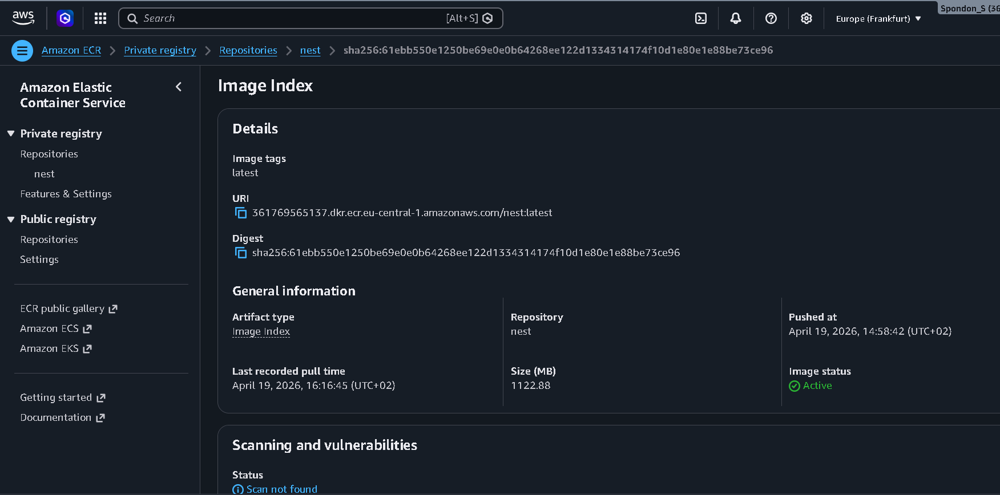
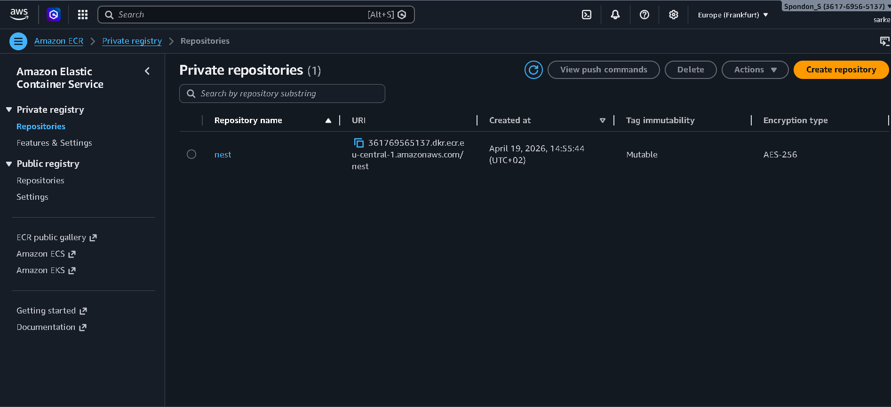

---

### ECS Cluster
> `dev-nest-ecs-cluster` — 1 service, 1 running task, Container Insights enabled

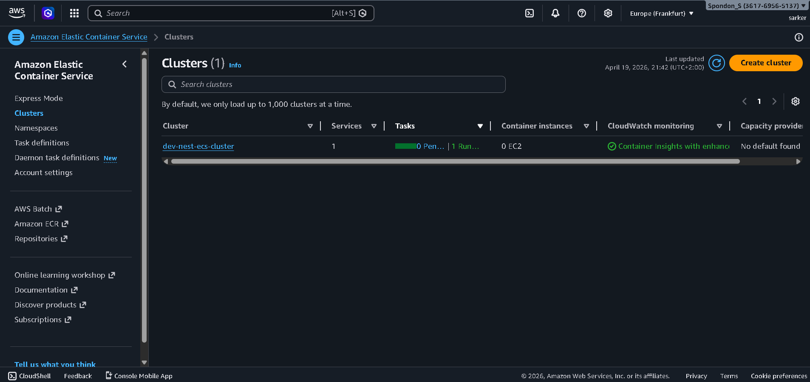

---

### ECS Task Definition
> `dev-nest-td:1` — Fargate, 1 vCPU, 3 GiB memory, awsvpc network mode

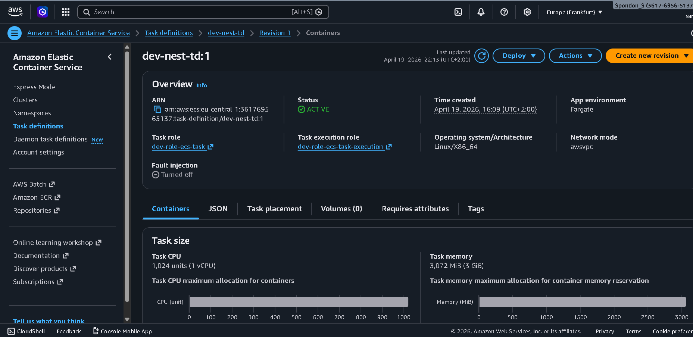

---

### ECS Service
> `dev-nest-ecs-service` — Active, 1 running task, healthy on Application Load Balancer

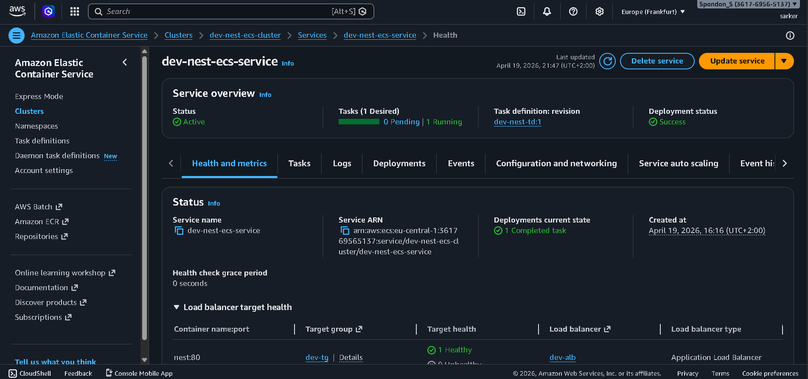

---

### Application Load Balancer
> `dev-alb` — internet-facing, 2 listeners (HTTP redirect + HTTPS forward), 2 availability zones

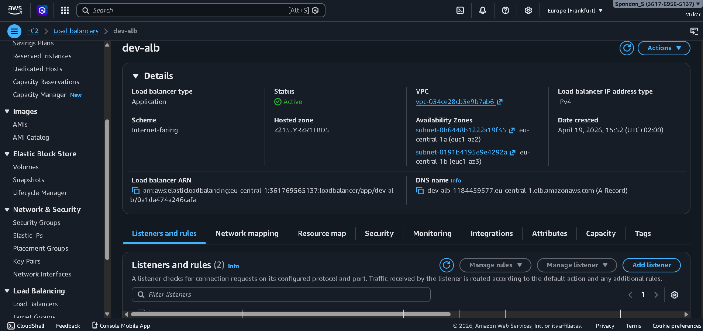

---

### Amazon RDS — MySQL Database
> `dev-db` — MySQL Community, `db.t3.micro`, available in `eu-central-1a`, private subnet

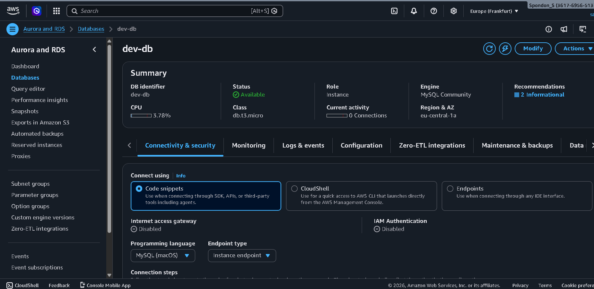

---

### Amazon S3 — Application Artefacts
> Application bundle, SQL migration script, and config file stored in S3

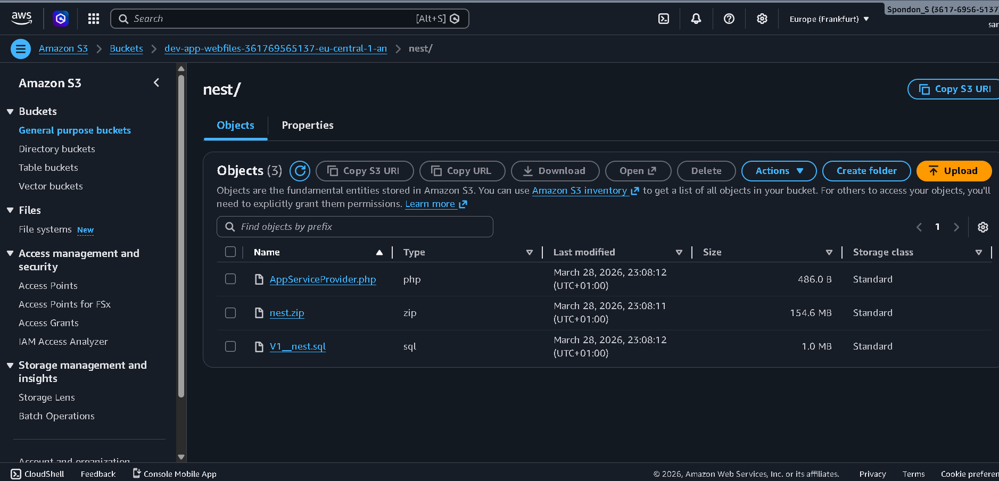

---

### AWS Certificate Manager
> TLS certificate issued for `aosnoteproject.com` and `*.aosnoteproject.com`

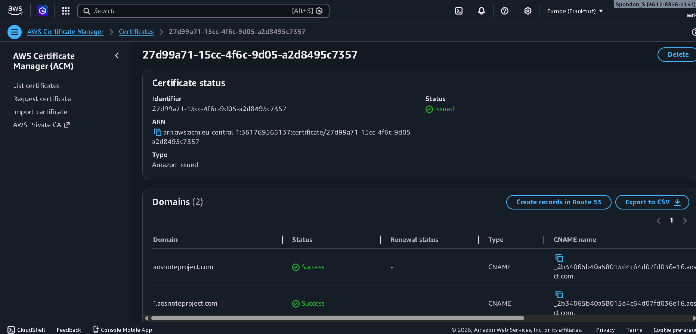

---

### Amazon Route 53
> Public hosted zone with NS, SOA, CNAME (ACM validation), and A record aliased to the ALB

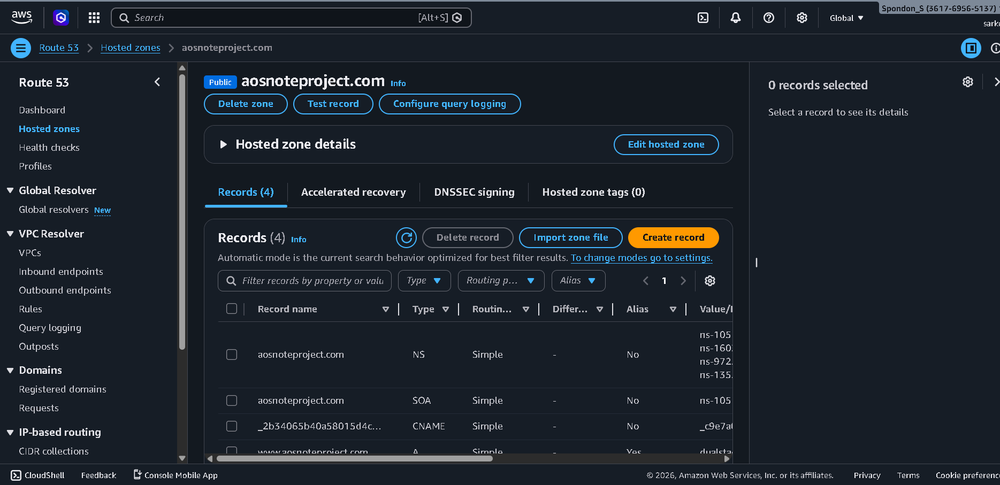

---

### IAM Roles
> Least-privilege roles for ECS task runtime, task execution, and S3 access

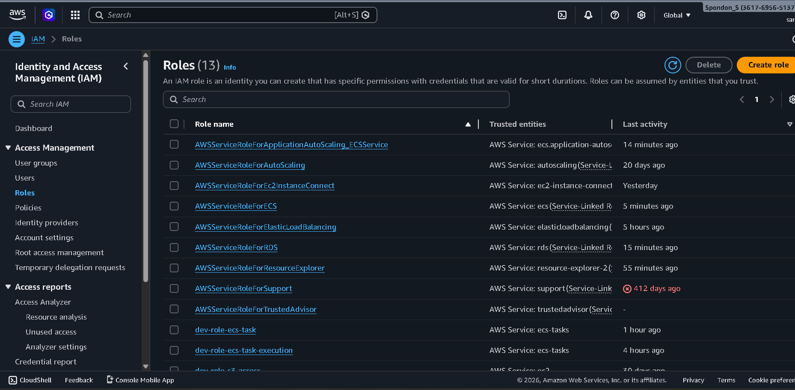

---

### VPC Security Groups
> Dedicated security groups for ALB, web tier, database, and EC2 Instance Connect

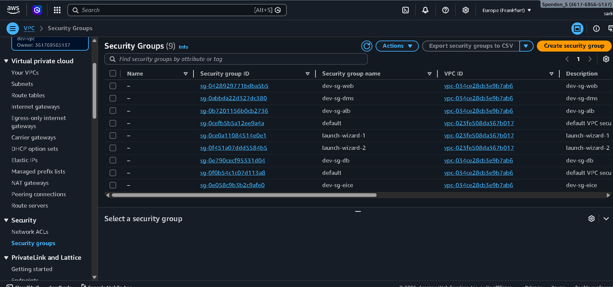

---

## 📁 Repository Structure

```
aws-dynamic-website-deployment/
├── README.md
└── screenshots/
    ├── ECR.png
    ├── ECR_1.png
    ├── ECS_clus.png
    ├── ECS_td.png
    ├── ECS_service.png
    ├── EC2_Load.png
    ├── RDS_database.png
    ├── S3_bucket.png
    ├── ACM_certificate.png
    ├── Route_53.png
    ├── IAM_roles.png
    └── Vpc_security.png
```

> **Note:** Application source code is maintained in a separate private repository to protect third-party assets. This repository documents the infrastructure architecture and deployment approach.

---

## 🧠 Key Learnings

- Containerising a NestJS application and managing the full image lifecycle from build → ECR → ECS Fargate
- Configuring an Application Load Balancer with HTTP-to-HTTPS redirect and ACM-managed TLS termination
- Designing a layered security group model to isolate the ALB, application tier, and database tier
- Connecting a Fargate task to a private RDS MySQL instance using VPC networking and IAM-scoped roles
- Routing a custom domain to an ALB using Route 53 alias records and validating ACM certificates via DNS CNAME records
- Using EC2 Instance Connect Endpoint (`dev-sg-eice`) for secure private access without a bastion host

---

## 👤 Author

**Spondon Sarker**  
MSc Computational and Applied Mathematics — FAU Erlangen-Nürnberg  
AWS Certified Solutions Architect – Associate | CKA (Certified Kubernetes Administrator)  
[GitHub](https://github.com/spondonsarker) · [LinkedIn](https://linkedin.com/in/spondonsarker)

---

*Region: eu-central-1 (Frankfurt)*
